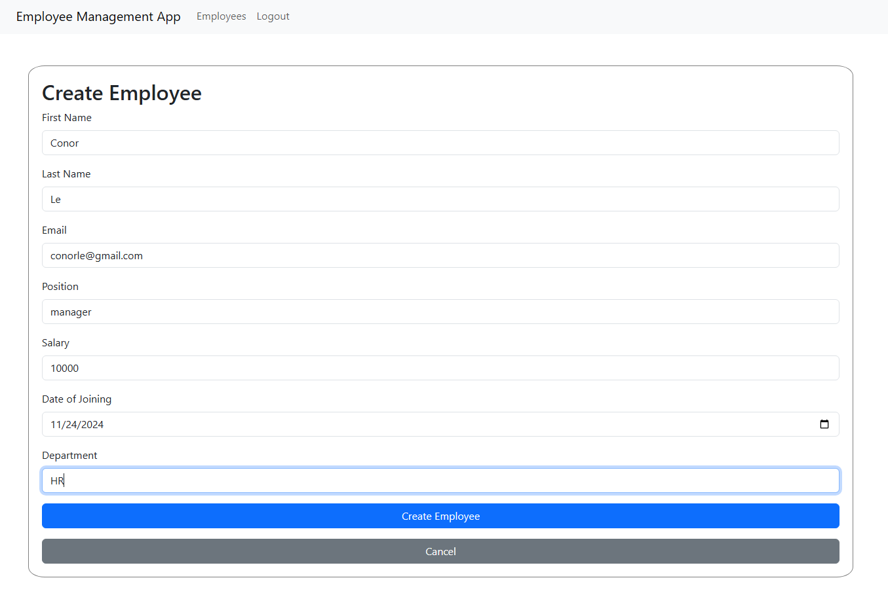

# Employee Management App

## Conor Le - 101411302

This project is an Employee Management Application built with React for the frontend and Node.js/Express for the backend. It allows users to manage employee data, including creating, editing, viewing, and deleting employee records.

## Features

- Docker container set up
- User authentication (login and signup)
- Create, edit, view, and delete employee records
- Search employees by department or position
- Responsive UI with React Bootstrap

## Screenshots

### Docker Container Set Up

### Postman Test User Sign Up

### Postman Test User Log In

### Postman Test Create Employee

### Postman Test Get All Employee

### Postman Test Get Employee By Id

### Postman Test Update Employee

### Postman Test Delete Employee

### Postman Test Search

### Home Screen Not Log In

### Signup Page

### Login Page

### Home Screen Log In

### Employee List

### Create Employee

### Result After Create Employee

### Edit Employee

### Result After Edit Employee

### Employee Details

### Search Function

## Usage

1. Open your browser and navigate to `http://localhost:3000`.
2. Sign up for a new account or log in with an existing account.
3. Use the application to manage employee records.

## API Endpoints

### User Routes

- `POST /api/v1/user/signup` - Sign up a new user
- `POST /api/v1/user/login` - Log in an existing user

### Employee Routes

- `GET /api/v1/emp/employees` - Get all employees
- `POST /api/v1/emp/employees` - Create a new employee
- `GET /api/v1/emp/employees/:eid` - Get an employee by ID
- `PUT /api/v1/emp/employees/:eid` - Update an employee by ID
- `DELETE /api/v1/emp/employees` - Delete an employee by ID
- `GET /api/v1/emp/employees?department=&position=` - Search employees by department or position